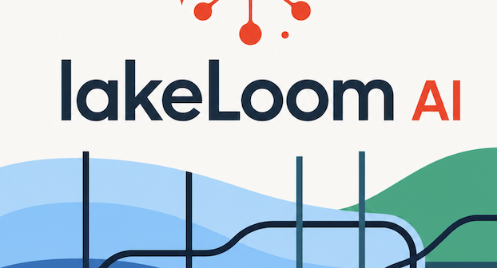

# lakeLoom AI
---
### Weave Requirements Into Rapid Databricks MVPs with Genie Code Ready Architecture and Session Plans



## Overview

**lakeLoom** is a rapid-MVP capture tool built on the Databricks platform. It enables field teams to record requirements — audio, screenshots, and documents — directly from iOS devices and stream them into a governed lakehouse architecture. The capture pipeline flows from iPhone through a Databricks App (AppKit) into Unity Catalog Volumes and Lakebase (Postgres), with full traceability from device to data asset.

The system uses a two-layer auth model: iOS devices authenticate via QR-code pairing (Xcode SPN for the app sidecar, ECDSA P-256 signatures for per-request integrity) while the app server handles all data-plane operations — writing to UC Volumes, streaming events via ZeroBus, and managing capture session lifecycle in Lakebase. Genie Code sessions then transform raw captures into architecture documents, implementation plans, and working Databricks solutions.

---

## Project Structure

**`lakeloom-infra/`** — Databricks Asset Bundle for shared infrastructure: Unity Catalog schemas, managed volumes (audio, screenshots, documents), SQL warehouse, Lakebase project, secret scopes, and the platform bootstrap job that provisions service principals and grants.

**`lakeloom-ai/`** — Databricks Asset Bundle for the AppKit application: Node.js/React frontend, Express API server with pairing and upload routes, Lakebase migrations, capture session lifecycle, post-deploy validation job, and Genie Code session fixtures.

**`architecture/`** — Design proposals and decisions shared between contributors. `hi_genie/` contains inbound context from Isaac (iOS); `hey_isaac/` contains outbound responses and contract specifications.

**`iOS/`** — Apple platform client (Xcode project). Handles QR-code scanning, Secure Enclave key generation, M2M token management, and multipart file uploads to the app API.

**`deploy.sh`** — Unified deployment script that orchestrates both bundles in dependency order with readiness checks between stages.

---

## Deployment

```bash
# First deployment (provisions SPNs, stores secrets, creates tables)
./deploy.sh --target dev --run-setup

# Subsequent deploys (infra unchanged, app only)
./deploy.sh --target dev --app

# App deploy without post-deploy validation
./deploy.sh --target dev --app --skip-validation

# Validate bundle YAML without deploying
./deploy.sh --target dev --validate
```

Run `./deploy.sh --help` for all options including `--infra`, `--skip-checks`, and `--destroy`.
